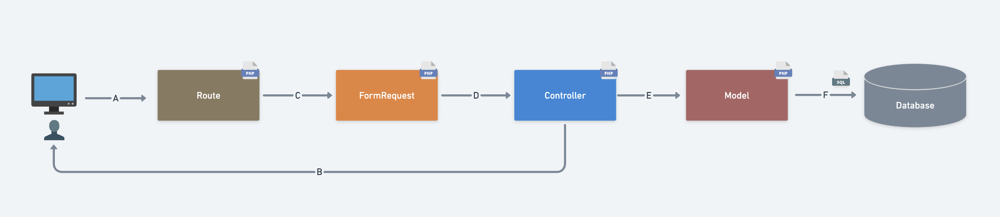
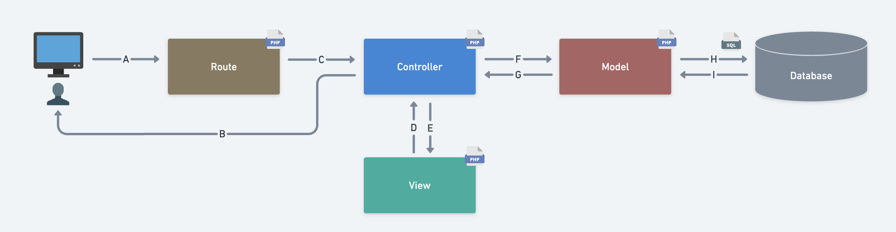

# Laravel Lesson レビュー①

## Routeについて

### `web.php`の目的を説明してください。
ブラウザからリクエストされたURLに対してルーティングを定義するファイルになります。
→ルーティングとはリクエストされたURLに応じて
　・コントローラーに処理を渡す
　・直接ビューを呼び出す
などを決める事になります。
ControllerとBladeによって記事が完成したら、そこにroutesであるweb.phpにてアドレスを付与致します。

アプリケーションの主要なルート定義を含み、ユーザーのリクエストを適切なコントローラーアクションにルーティングする役割を果たします。

### `route()`の引数と戻り値について説明してください。
View側でURLを指定するときに使用します。
引数にはURLを取得したいルート名を指定することによってそのルート名のURLが返されます。
引数に指定するルート名はURLの末尾になります。
### ルートネームを定義するメリットについて説明してください。
パスが長い時にタイプミスをする可能性や、パスが変更になった際の置き換え作業が楽になります。
また、指定したルート名が存在しない場合エラーを表示してくれるので開発効率も上がります。2021

### ルートパラメータがどんな時に必要なのか説明してください。
URLからユーザーIDや記事IDを取り出したい場合にルートパラメータの設定をします。
取り出したいURLの部分を{}で囲むことによって、その囲まれたパラメータをcontrollerへ送ることができます。
Laravelでは、{}で囲まれた部分をルーティングにおけるパラメータとして扱います。
ルーティングやcontrollerのメソッドでパラメータを受け取る際に、パラメータ名をメソッドの引数名として使用することで、自動的にパラメータの値が渡されるので、URLの一部をcontrollerに渡すことができます。
## Controllerについて

### コンストラクタメソッドが実行されるのはどのタイミングですか？
クラスからインスタンスを生成する際に自動的に実行されます。

### `TodoController`のコンストラクタで何をしているか説明してください。
todosテーブルの情報を連想配列で取得し、それ以降の処理でtodosテーブルの情報を使えるようにしています。

### `$request->all()`において、どんな情報をどんなデータ型で取得しようとしているか説明してください。
リクエストの全データを連想配列で取得しようとしています。
キーにはフォームのinput要素のname属性の値が入ります。

## Modelについて

### `$this->todo->fill($inputs)`が何をしているかModelの`$fillable`を交えて説明してください。
$inputsには$request->all()が入っており、ここでフォームから送られてきたリクエストのデータが自動で配列となり、そのデータをDBねinputしています。
そこにモデルクラスに$fillableを定義することにより、対応するカラム(今回ではcontentカラム)以外の登録・更新ができないような状態を作成しています。

### なぜ$fillableが必要なのか説明してください。
ユーザー側で入力項目等を不正に増やし、変更してほしくない値(例、会員ランク等)を更新してしまう可能性があり、それを防ぐために必要になります。

### `$this->todo->save()`が何をしているか説明してください。
入力されたフォームの内容をDBへ保存をしています。

### `$this->todo->find($id)`が何をしているか説明してください。
contentカラムへ保存された内容のidを取得しています。

### `$this->todo->all()`の戻り値について説明してください。
contentカラムへ保存された内容の全データを配列で返しています。

### `Collection`クラスとメリットについて説明してください。
Laravel独自の形式で配列を操作する機能が拡張されたラッパークラスです。
配列をコレクション形式に変換後、定義されているメソットを呼び出すことで様々な操作や機能を簡単に実装することができます。

## Viewについて

### `view()`の第１・第２引数の役割と、何をするための関数か説明してください。
第一引数ではresources/viewsディレクトリ中のviewファイル名を指定し、
第二引数ではビューで使用するデータの配列を指定することによって、第一引数にて指定したviewファイルに値(配列)を渡すことができます。
web.phpやcontrollerでviewファイルを表示させたい時に使用する関数になります。

$todos = $this->todo->all();
        return view('todo.index', ['todos' => $todos]);
こちらの'todos'はblade内で使用されている変数名になり、$todosはそのコレクションになります。
$todosに関しては、下記のように書き換える事もできます。
'todos' => $this->todo->all();

### `@extends`について説明してください。
index.blade.phpにて使用されている@extends('layouts.base')を例にすると、
layoutsの中にあるbaseを継承するという宣言をしています。
これで親のファイルを継承しています。親と子を結びつけるチェーンのような役割になります。

### `@yield`・`@section`について説明してください。
-@section-
親(@extends)の@yield部分に召喚されるトンネルとなります。トンネルなので入り口(@section)と出口(@endsection)が必要になります。

-@yield-
子の@section() ~ @endsectionというトンネルを通す穴です。親(@extends)に記載します。穴はひとつなので、閉じる必要もなしで@yield()一つのみ記載します。

### ディレクティブを使用しbladeを分割するメリットを説明してください。
Bladeを使うメリットは「継承」と「セクション分け」にあります。
後に画面を増やした際に共通のパーツを新しく記述し直す必要がなくなります。

### `{{}}`と`{!! !!}`の違いについて説明してください
{{}}ではhtmlタグをエスケープし、{!! !!}ではエスケープしません。

### `@csrf`は何をしているか説明してください。
CSRF攻撃からアプリケーションを守っています。
CSRF対策になります。

## FormRequestについて

### `TodoRequest`は何をするためのクラスか説明してください。
バリデーションを実装するためのクラスになります。
FormRequestクラスを継承しています。

### bladeファイルにおいて`$errors`にエラーメッセージが格納されるのはどんな時か説明してください。
バリデーションチェックに引っかかった場合に対応するエラーメッセージが格納されます。

### `$errors->any()`をなぜ使うか説明してください。
エラーが1つでもある場合はtrueを返すので、複数入力項目がある場合に全ての項目に正しい入力内容を促すことができます。

### `$errors->all()`で何を取得しているか説明してください。
全てのerror変数を取得しています。
error変数は連想配列として保存されているため、foreachで取得することによってまとめて教示させる事ができます。

## その他

### マイグレーションファイルでテーブル構成を管理するメリットを説明してください。
チーム内で同一のテーブル構成にできたり、テーブル定義の変更の履歴を管理できるメリットがあります。
複数人が全く同じテーブル構成を全開発者の開発環境に用意することが出来ます。

### 以下はToDo新規作成の処理の流れを表した図です。A~Bを処理の流れに沿って並べ替え処理を説明してください。

1. A: ユーザが作成ボタンを押下し/todoに入力した内容をPOST
2. C: '/todo/create'にアクセスし、TodoControllerのcreateメソッドの処理を実行
3. D: バリデーションチェック、アクセスしたユーザーがそのリクエストを実行する権限があるかを確認し、controllerへリクエストを渡す。
4. E: Todoモデルを呼び出しインスタンス化
5. F: データベースへ保存
6. B: 一覧画面にリダイレクト

### 以下はToDo一覧画面の処理の流れを表した図です。A~Bを処理の流れに沿って並べ替え処理を説明してください。

1. A: ユーザがToDo一覧画面(/todo)にアクセス
2. C: '/todo'にアクセスし、TodoControllerのindexメソッドの処理を実行
3. F: モデルにデータベースから全データを取得するよう指示
4. H: データベースから全データを呼び出す処理を行う
5. I: データベースより全データを取得
6. G: controllerへ取得したデータをコレクションインスタンスで返却
7. E: viewへToDoの一覧データを渡し、todosという名前の変数に$todosの中身を入れて、todo/index.blade.phpで使えるようにします
8. D: oreach文を実行し、Todoインスタンスから対応するレコードのカラム値を取得し、controllerへ返却
9. B: クライアントにレスポンスを返却
